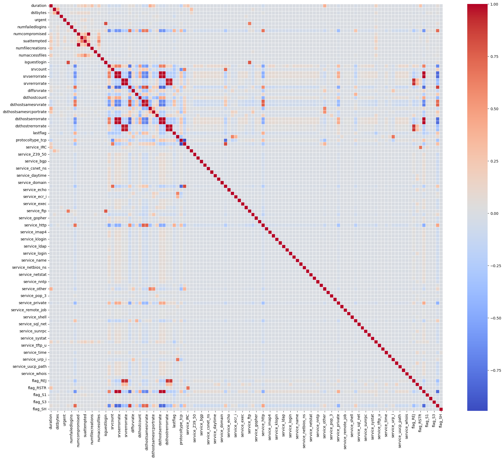

```python
import numpy as np
import pandas as pd
import matplotlib.pyplot as plt
```


```python
df1 = pd.read_csv("C:/Users/deepi/Downloads/Train_Data (1).csv")
df1.head()
```


<div>
<style scoped>
    .dataframe tbody tr th:only-of-type {
        vertical-align: middle;
    }

    .dataframe tbody tr th {
        vertical-align: top;
    }

    .dataframe thead th {
        text-align: right;
    }
</style>
<table border="1" class="dataframe">
  <thead>
    <tr style="text-align: right;">
      <th></th>
      <th>duration</th>
      <th>protocoltype</th>
      <th>service</th>
      <th>flag</th>
      <th>srcbytes</th>
      <th>dstbytes</th>
      <th>land</th>
      <th>wrongfragment</th>
      <th>urgent</th>
      <th>hot</th>
      <th>...</th>
      <th>dsthostsamesrvrate</th>
      <th>dsthostdiffsrvrate</th>
      <th>dsthostsamesrcportrate</th>
      <th>dsthostsrvdiffhostrate</th>
      <th>dsthostserrorrate</th>
      <th>dsthostsrvserrorrate</th>
      <th>dsthostrerrorrate</th>
      <th>dsthostsrvrerrorrate</th>
      <th>lastflag</th>
      <th>attack</th>
    </tr>
  </thead>
  <tbody>
    <tr>
      <th>0</th>
      <td>0</td>
      <td>tcp</td>
      <td>netbios_dgm</td>
      <td>REJ</td>
      <td>0</td>
      <td>0</td>
      <td>0</td>
      <td>0</td>
      <td>0</td>
      <td>0</td>
      <td>...</td>
      <td>0.06</td>
      <td>0.06</td>
      <td>0.00</td>
      <td>0.00</td>
      <td>0.00</td>
      <td>0.0</td>
      <td>1.00</td>
      <td>1.0</td>
      <td>21</td>
      <td>1</td>
    </tr>
    <tr>
      <th>1</th>
      <td>0</td>
      <td>tcp</td>
      <td>smtp</td>
      <td>SF</td>
      <td>1239</td>
      <td>400</td>
      <td>0</td>
      <td>0</td>
      <td>0</td>
      <td>0</td>
      <td>...</td>
      <td>0.45</td>
      <td>0.04</td>
      <td>0.00</td>
      <td>0.00</td>
      <td>0.11</td>
      <td>0.0</td>
      <td>0.02</td>
      <td>0.0</td>
      <td>18</td>
      <td>0</td>
    </tr>
    <tr>
      <th>2</th>
      <td>0</td>
      <td>tcp</td>
      <td>http</td>
      <td>SF</td>
      <td>222</td>
      <td>945</td>
      <td>0</td>
      <td>0</td>
      <td>0</td>
      <td>0</td>
      <td>...</td>
      <td>1.00</td>
      <td>0.00</td>
      <td>0.02</td>
      <td>0.03</td>
      <td>0.00</td>
      <td>0.0</td>
      <td>0.00</td>
      <td>0.0</td>
      <td>21</td>
      <td>0</td>
    </tr>
    <tr>
      <th>3</th>
      <td>0</td>
      <td>tcp</td>
      <td>http</td>
      <td>SF</td>
      <td>235</td>
      <td>1380</td>
      <td>0</td>
      <td>0</td>
      <td>0</td>
      <td>0</td>
      <td>...</td>
      <td>1.00</td>
      <td>0.00</td>
      <td>0.00</td>
      <td>0.00</td>
      <td>0.00</td>
      <td>0.0</td>
      <td>0.00</td>
      <td>0.0</td>
      <td>21</td>
      <td>0</td>
    </tr>
    <tr>
      <th>4</th>
      <td>0</td>
      <td>tcp</td>
      <td>uucp_path</td>
      <td>REJ</td>
      <td>0</td>
      <td>0</td>
      <td>0</td>
      <td>0</td>
      <td>0</td>
      <td>0</td>
      <td>...</td>
      <td>0.01</td>
      <td>0.08</td>
      <td>0.00</td>
      <td>0.00</td>
      <td>0.00</td>
      <td>0.0</td>
      <td>1.00</td>
      <td>1.0</td>
      <td>19</td>
      <td>1</td>
    </tr>
  </tbody>
</table>
<p>5 rows × 43 columns</p>
</div>


```python
df1.shape
```


    (86845, 43)


```python
df1.info()
```

    <class 'pandas.core.frame.DataFrame'>
    RangeIndex: 86845 entries, 0 to 86844
    Data columns (total 43 columns):
     #   Column                  Non-Null Count  Dtype  
    ---  ------                  --------------  -----  
     0   duration                86845 non-null  int64  
     1   protocoltype            86845 non-null  object 
     2   service                 86845 non-null  object 
     3   flag                    86845 non-null  object 
     4   srcbytes                86845 non-null  int64  
     5   dstbytes                86845 non-null  int64  
     6   land                    86845 non-null  int64  
     7   wrongfragment           86845 non-null  int64  
     8   urgent                  86845 non-null  int64  
     9   hot                     86845 non-null  int64  
     10  numfailedlogins         86845 non-null  int64  
     11  loggedin                86845 non-null  int64  
     12  numcompromised          86845 non-null  int64  
     13  rootshell               86845 non-null  int64  
     14  suattempted             86845 non-null  int64  
     15  numroot                 86845 non-null  int64  
     16  numfilecreations        86845 non-null  int64  
     17  numshells               86845 non-null  int64  
     18  numaccessfiles          86845 non-null  int64  
     19  numoutboundcmds         86845 non-null  int64  
     20  ishostlogin             86845 non-null  int64  
     21  isguestlogin            86845 non-null  int64  
     22  count                   86845 non-null  int64  
     23  srvcount                86845 non-null  int64  
     24  serrorrate              86845 non-null  float64
     25  srvserrorrate           86845 non-null  float64
     26  rerrorrate              86845 non-null  float64
     27  srvrerrorrate           86845 non-null  float64
     28  samesrvrate             86845 non-null  float64
     29  diffsrvrate             86845 non-null  float64
     30  srvdiffhostrate         86845 non-null  float64
     31  dsthostcount            86845 non-null  int64  
     32  dsthostsrvcount         86845 non-null  int64  
     33  dsthostsamesrvrate      86845 non-null  float64
     34  dsthostdiffsrvrate      86845 non-null  float64
     35  dsthostsamesrcportrate  86845 non-null  float64
     36  dsthostsrvdiffhostrate  86845 non-null  float64
     37  dsthostserrorrate       86845 non-null  float64
     38  dsthostsrvserrorrate    86845 non-null  float64
     39  dsthostrerrorrate       86845 non-null  float64
     40  dsthostsrvrerrorrate    86845 non-null  float64
     41  lastflag                86845 non-null  int64  
     42  attack                  86845 non-null  int64  
    dtypes: float64(15), int64(25), object(3)
    memory usage: 28.5+ MB
    


```python
df1.isnull().sum()
```


    duration                  0
    protocoltype              0
    service                   0
    flag                      0
    srcbytes                  0
    dstbytes                  0
    land                      0
    wrongfragment             0
    urgent                    0
    hot                       0
    numfailedlogins           0
    loggedin                  0
    numcompromised            0
    rootshell                 0
    suattempted               0
    numroot                   0
    numfilecreations          0
    numshells                 0
    numaccessfiles            0
    numoutboundcmds           0
    ishostlogin               0
    isguestlogin              0
    count                     0
    srvcount                  0
    serrorrate                0
    srvserrorrate             0
    rerrorrate                0
    srvrerrorrate             0
    samesrvrate               0
    diffsrvrate               0
    srvdiffhostrate           0
    dsthostcount              0
    dsthostsrvcount           0
    dsthostsamesrvrate        0
    dsthostdiffsrvrate        0
    dsthostsamesrcportrate    0
    dsthostsrvdiffhostrate    0
    dsthostserrorrate         0
    dsthostsrvserrorrate      0
    dsthostrerrorrate         0
    dsthostsrvrerrorrate      0
    lastflag                  0
    attack                    0
    dtype: int64


```python
unique_values = df1.apply(lambda x: x.unique())
print("Unique values in each column:")
print(unique_values)
```

    Unique values in each column:
    duration                  [0, 3, 7930, 7, 2560, 40, 5, 13164, 3324, 1, 2...
    protocoltype                                               [tcp, udp, icmp]
    service                   [netbios_dgm, smtp, http, uucp_path, private, ...
    flag                         [REJ, SF, S0, RSTR, RSTO, S1, S3, S2, SH, OTH]
    srcbytes                  [0, 1239, 222, 235, 348, 242, 255, 718, 1837, ...
    dstbytes                  [0, 400, 945, 1380, 2029, 380, 37867, 8185, 33...
    land                                                                 [0, 1]
    wrongfragment                                                           [0]
    urgent                                                            [0, 2, 1]
    hot                       [0, 5, 30, 6, 4, 1, 24, 2, 22, 44, 19, 3, 14, ...
    numfailedlogins                                             [0, 1, 3, 2, 4]
    loggedin                                                             [0, 1]
    numcompromised            [0, 2, 21, 3, 4, 1, 6, 767, 78, 5, 17, 198, 16...
    rootshell                                                            [0, 1]
    suattempted                                                       [0, 2, 1]
    numroot                   [0, 2, 6, 9, 17, 1, 4, 5, 857, 71, 218, 184, 1...
    numfilecreations          [0, 17, 2, 1, 7, 25, 14, 8, 36, 40, 16, 22, 29...
    numshells                                                         [0, 1, 2]
    numaccessfiles                               [0, 1, 6, 2, 3, 8, 5, 9, 7, 4]
    numoutboundcmds                                                         [0]
    ishostlogin                                                          [0, 1]
    isguestlogin                                                         [0, 1]
    count                     [277, 1, 21, 4, 256, 27, 129, 146, 5, 227, 147...
    srvcount                  [15, 1, 25, 4, 3, 28, 7, 20, 5, 19, 11, 17, 16...
    serrorrate                [0.0, 1.0, 0.98, 0.99, 0.5, 0.08, 0.14, 0.33, ...
    srvserrorrate             [0.0, 1.0, 0.5, 0.14, 0.33, 0.04, 0.25, 0.17, ...
    rerrorrate                [1.0, 0.0, 0.02, 0.5, 0.58, 0.04, 0.25, 0.03, ...
    srvrerrorrate             [1.0, 0.0, 0.58, 0.07, 0.85, 0.5, 0.08, 0.75, ...
    samesrvrate               [0.05, 1.0, 0.01, 0.16, 0.14, 0.02, 0.13, 0.23...
    diffsrvrate               [0.06, 0.0, 0.05, 0.1, 0.07, 0.08, 0.27, 0.11,...
    srvdiffhostrate           [0.0, 0.08, 0.07, 0.25, 0.12, 0.33, 0.18, 0.2,...
    dsthostcount              [255, 57, 31, 4, 68, 51, 120, 1, 69, 61, 23, 3...
    dsthostsrvcount           [15, 116, 255, 3, 11, 5, 19, 244, 17, 1, 51, 2...
    dsthostsamesrvrate        [0.06, 0.45, 1.0, 0.01, 0.04, 0.02, 0.07, 0.96...
    dsthostdiffsrvrate        [0.06, 0.04, 0.0, 0.08, 0.09, 0.07, 0.01, 0.5,...
    dsthostsamesrcportrate    [0.0, 0.02, 0.03, 0.25, 0.01, 0.99, 0.15, 1.0,...
    dsthostsrvdiffhostrate    [0.0, 0.03, 0.04, 0.15, 0.06, 0.14, 0.01, 0.1,...
    dsthostserrorrate         [0.0, 0.11, 1.0, 0.02, 0.5, 0.66, 0.01, 0.88, ...
    dsthostsrvserrorrate      [0.0, 1.0, 0.01, 0.05, 0.02, 0.75, 0.25, 0.36,...
    dsthostrerrorrate         [1.0, 0.02, 0.0, 0.25, 0.53, 0.54, 0.14, 0.01,...
    dsthostsrvrerrorrate      [1.0, 0.0, 0.59, 0.76, 0.89, 0.01, 0.57, 0.04,...
    lastflag                  [21, 18, 19, 20, 12, 17, 14, 9, 16, 11, 15, 4,...
    attack                                                               [1, 0]
    dtype: object
    


```python
one_unique_value_cols = df1.columns[df1.nunique() == 1]
print("Columns with exactly one unique value:")
print(one_unique_value_cols)
```

    Columns with exactly one unique value:
    Index(['wrongfragment', 'numoutboundcmds'], dtype='object')
    


```python
df1.drop(columns=['wrongfragment', 'numoutboundcmds'],inplace=True)
```


```python
df1.shape
```


    (86845, 41)


```python
import seaborn as sns
```


```python
numerical_columns = df1.select_dtypes(include=['number']).columns
categorical_columns = df1.select_dtypes(include=['object', 'category', 'bool']).columns
print(numerical_columns)
print(categorical_columns)
```

    Index(['duration', 'srcbytes', 'dstbytes', 'land', 'urgent', 'hot',
           'numfailedlogins', 'loggedin', 'numcompromised', 'rootshell',
           'suattempted', 'numroot', 'numfilecreations', 'numshells',
           'numaccessfiles', 'ishostlogin', 'isguestlogin', 'count', 'srvcount',
           'serrorrate', 'srvserrorrate', 'rerrorrate', 'srvrerrorrate',
           'samesrvrate', 'diffsrvrate', 'srvdiffhostrate', 'dsthostcount',
           'dsthostsrvcount', 'dsthostsamesrvrate', 'dsthostdiffsrvrate',
           'dsthostsamesrcportrate', 'dsthostsrvdiffhostrate', 'dsthostserrorrate',
           'dsthostsrvserrorrate', 'dsthostrerrorrate', 'dsthostsrvrerrorrate',
           'lastflag', 'attack'],
          dtype='object')
    Index(['protocoltype', 'service', 'flag'], dtype='object')
    


```python
x=df1.drop(['attack'],axis=1)
y=df1['attack']
```


```python
print(y)
```

    0        1
    1        0
    2        0
    3        0
    4        1
            ..
    86840    0
    86841    0
    86842    0
    86843    0
    86844    0
    Name: attack, Length: 86845, dtype: int64
    


```python
from sklearn.preprocessing import OneHotEncoder, LabelEncoder
categorical_features = ['protocoltype', 'service', 'flag']
X_encoded = pd.get_dummies(x, columns=categorical_features)
```


```python
mapping = {'neptune': 1, 'normal': 0}
y_encoded = y.map(mapping)
print(y_encoded)
```

    0       NaN
    1       NaN
    2       NaN
    3       NaN
    4       NaN
             ..
    86840   NaN
    86841   NaN
    86842   NaN
    86843   NaN
    86844   NaN
    Name: attack, Length: 86845, dtype: float64
    


```python
from imblearn.over_sampling import SMOTE
from sklearn.model_selection import train_test_split


X_train, X_test, y_train, y_test = train_test_split(X_encoded, y, test_size=0.2, random_state=42)

smote = SMOTE(random_state=42)
X_train_res, y_train_res = smote.fit_resample(X_train, y_train)
```


```python
print(X_encoded)
```

           duration  srcbytes  dstbytes  land  urgent  hot  numfailedlogins  \
    0             0         0         0     0       0    0                0   
    1             0      1239       400     0       0    0                0   
    2             0       222       945     0       0    0                0   
    3             0       235      1380     0       0    0                0   
    4             0         0         0     0       0    0                0   
    ...         ...       ...       ...   ...     ...  ...              ...   
    86840         0       216       674     0       0    0                0   
    86841         0       368      1725     0       0    0                0   
    86842        28      1483      4152     0       0   30                0   
    86843         0      1679       385     0       0    0                0   
    86844     11343      3396     16694     0       0    0                0   
    
           loggedin  numcompromised  rootshell  ...  flag_OTH  flag_REJ  \
    0             0               0          0  ...     False      True   
    1             1               0          0  ...     False     False   
    2             1               0          0  ...     False     False   
    3             1               0          0  ...     False     False   
    4             0               0          0  ...     False      True   
    ...         ...             ...        ...  ...       ...       ...   
    86840         1               0          0  ...     False     False   
    86841         1               0          0  ...     False     False   
    86842         1               0          0  ...     False     False   
    86843         1               0          0  ...     False     False   
    86844         1               0          0  ...     False     False   
    
           flag_RSTO  flag_RSTR  flag_S0  flag_S1  flag_S2  flag_S3  flag_SF  \
    0          False      False    False    False    False    False    False   
    1          False      False    False    False    False    False     True   
    2          False      False    False    False    False    False     True   
    3          False      False    False    False    False    False     True   
    4          False      False    False    False    False    False    False   
    ...          ...        ...      ...      ...      ...      ...      ...   
    86840      False      False    False    False    False    False     True   
    86841      False      False    False    False    False    False     True   
    86842      False      False    False    False    False    False     True   
    86843      False      False    False    False    False    False     True   
    86844      False      False    False    False    False    False     True   
    
           flag_SH  
    0        False  
    1        False  
    2        False  
    3        False  
    4        False  
    ...        ...  
    86840    False  
    86841    False  
    86842    False  
    86843    False  
    86844    False  
    
    [86845 rows x 115 columns]
    


```python
print(y)
```

    0        1
    1        0
    2        0
    3        0
    4        1
            ..
    86840    0
    86841    0
    86842    0
    86843    0
    86844    0
    Name: attack, Length: 86845, dtype: int64
    


```python
y_encoded_series = pd.Series(y)
print(y_encoded_series.value_counts())
```

    attack
    0    53847
    1    32998
    Name: count, dtype: int64
    


```python
print(y_encoded_series)
```

    0        1
    1        0
    2        0
    3        0
    4        1
            ..
    86840    0
    86841    0
    86842    0
    86843    0
    86844    0
    Name: attack, Length: 86845, dtype: int64
    


```python
y_train_res_series = pd.Series(y_train_res)
print(y_train_res_series.value_counts())
```

    attack
    1    43085
    0    43085
    Name: count, dtype: int64
    


```python
numerical_features = X_encoded

correlation_matrix = numerical_features.corr()

plt.figure(figsize=(24, 20))
sns.heatmap(correlation_matrix, annot=False, cmap='coolwarm', linewidths=0.5)
plt.show()
```


    

    


```python
from sklearn.neighbors import KNeighborsClassifier
from sklearn.preprocessing import StandardScaler, MinMaxScaler, PolynomialFeatures, RobustScaler
from sklearn.pipeline import make_pipeline

pipeline = make_pipeline(MinMaxScaler(), KNeighborsClassifier())
pipeline.fit(X_train_res, y_train_res)

y_pred = pipeline.predict(X_test)
from sklearn.metrics import f1_score
f1 = f1_score(y_test, y_pred)
print("F1 Score:", f1)
```

    F1 Score: 0.9999243284146803
    


```python
from sklearn.model_selection import RandomizedSearchCV
from sklearn.neighbors import KNeighborsClassifier

knn = KNeighborsClassifier()

# Define the parameter grid
param_grid = {
'n_neighbors': range(1, 21), # Number of neighbors to consider
'weights': ['uniform', 'distance'], # Weight function used in prediction
'metric': ['euclidean', 'manhattan'] # Distance metric used for the tree
}

# Perform RandomizedSearchCV
random_search = RandomizedSearchCV(estimator=knn, param_distributions=param_grid, n_iter=10, cv=5, scoring='f1_macro', random_state=42)
random_search.fit(X_train_res, y_train_res)

# Print the best parameters and best score
print("Best Parameters:", random_search.best_params_)
print("Best F1 Score:", random_search.best_score_)

# Evaluate the model with best parameters on the test set
best_model = random_search.best_estimator_
y_pred = best_model.predict(X_test)
```

    Best Parameters: {'weights': 'uniform', 'n_neighbors': 1, 'metric': 'euclidean'}
    Best F1 Score: 0.9996982708338276
    


```python
test_data = pd.read_csv("C:/Users/deepi/Downloads/Test_Data (1).csv")
test_data.head()
```


<div>
<style scoped>
    .dataframe tbody tr th:only-of-type {
        vertical-align: middle;
    }

    .dataframe tbody tr th {
        vertical-align: top;
    }

    .dataframe thead th {
        text-align: right;
    }
</style>
<table border="1" class="dataframe">
  <thead>
    <tr style="text-align: right;">
      <th></th>
      <th>duration</th>
      <th>protocoltype</th>
      <th>service</th>
      <th>flag</th>
      <th>srcbytes</th>
      <th>dstbytes</th>
      <th>land</th>
      <th>wrongfragment</th>
      <th>urgent</th>
      <th>hot</th>
      <th>...</th>
      <th>dsthostsrvcount</th>
      <th>dsthostsamesrvrate</th>
      <th>dsthostdiffsrvrate</th>
      <th>dsthostsamesrcportrate</th>
      <th>dsthostsrvdiffhostrate</th>
      <th>dsthostserrorrate</th>
      <th>dsthostsrvserrorrate</th>
      <th>dsthostrerrorrate</th>
      <th>dsthostsrvrerrorrate</th>
      <th>lastflag</th>
    </tr>
  </thead>
  <tbody>
    <tr>
      <th>0</th>
      <td>0</td>
      <td>tcp</td>
      <td>mtp</td>
      <td>REJ</td>
      <td>0</td>
      <td>0</td>
      <td>0</td>
      <td>0</td>
      <td>0</td>
      <td>0</td>
      <td>...</td>
      <td>7</td>
      <td>0.03</td>
      <td>0.08</td>
      <td>0.0</td>
      <td>0.0</td>
      <td>0.0</td>
      <td>0.0</td>
      <td>1.0</td>
      <td>1.0</td>
      <td>20</td>
    </tr>
    <tr>
      <th>1</th>
      <td>0</td>
      <td>tcp</td>
      <td>http</td>
      <td>SF</td>
      <td>199</td>
      <td>1721</td>
      <td>0</td>
      <td>0</td>
      <td>0</td>
      <td>0</td>
      <td>...</td>
      <td>255</td>
      <td>1.00</td>
      <td>0.00</td>
      <td>0.0</td>
      <td>0.0</td>
      <td>0.0</td>
      <td>0.0</td>
      <td>0.0</td>
      <td>0.0</td>
      <td>21</td>
    </tr>
    <tr>
      <th>2</th>
      <td>0</td>
      <td>tcp</td>
      <td>discard</td>
      <td>S0</td>
      <td>0</td>
      <td>0</td>
      <td>0</td>
      <td>0</td>
      <td>0</td>
      <td>0</td>
      <td>...</td>
      <td>14</td>
      <td>0.05</td>
      <td>0.09</td>
      <td>0.0</td>
      <td>0.0</td>
      <td>1.0</td>
      <td>1.0</td>
      <td>0.0</td>
      <td>0.0</td>
      <td>18</td>
    </tr>
    <tr>
      <th>3</th>
      <td>0</td>
      <td>tcp</td>
      <td>telnet</td>
      <td>S0</td>
      <td>0</td>
      <td>0</td>
      <td>0</td>
      <td>0</td>
      <td>0</td>
      <td>0</td>
      <td>...</td>
      <td>2</td>
      <td>0.01</td>
      <td>0.09</td>
      <td>0.0</td>
      <td>0.0</td>
      <td>1.0</td>
      <td>1.0</td>
      <td>0.0</td>
      <td>0.0</td>
      <td>18</td>
    </tr>
    <tr>
      <th>4</th>
      <td>0</td>
      <td>tcp</td>
      <td>exec</td>
      <td>S0</td>
      <td>0</td>
      <td>0</td>
      <td>0</td>
      <td>0</td>
      <td>0</td>
      <td>0</td>
      <td>...</td>
      <td>16</td>
      <td>0.06</td>
      <td>0.06</td>
      <td>0.0</td>
      <td>0.0</td>
      <td>1.0</td>
      <td>1.0</td>
      <td>0.0</td>
      <td>0.0</td>
      <td>20</td>
    </tr>
  </tbody>
</table>
<p>5 rows × 42 columns</p>
</div>


```python
test_data.drop(columns=['wrongfragment', 'numoutboundcmds'],inplace=True)
```


```python
categorical_features = ['protocoltype', 'service', 'flag']
test_data = pd.get_dummies(test_data, columns=categorical_features)
```


```python
test_data.head()
```


<div>
<style scoped>
    .dataframe tbody tr th:only-of-type {
        vertical-align: middle;
    }

    .dataframe tbody tr th {
        vertical-align: top;
    }

    .dataframe thead th {
        text-align: right;
    }
</style>
<table border="1" class="dataframe">
  <thead>
    <tr style="text-align: right;">
      <th></th>
      <th>duration</th>
      <th>srcbytes</th>
      <th>dstbytes</th>
      <th>land</th>
      <th>urgent</th>
      <th>hot</th>
      <th>numfailedlogins</th>
      <th>loggedin</th>
      <th>numcompromised</th>
      <th>rootshell</th>
      <th>...</th>
      <th>flag_OTH</th>
      <th>flag_REJ</th>
      <th>flag_RSTO</th>
      <th>flag_RSTR</th>
      <th>flag_S0</th>
      <th>flag_S1</th>
      <th>flag_S2</th>
      <th>flag_S3</th>
      <th>flag_SF</th>
      <th>flag_SH</th>
    </tr>
  </thead>
  <tbody>
    <tr>
      <th>0</th>
      <td>0</td>
      <td>0</td>
      <td>0</td>
      <td>0</td>
      <td>0</td>
      <td>0</td>
      <td>0</td>
      <td>0</td>
      <td>0</td>
      <td>0</td>
      <td>...</td>
      <td>False</td>
      <td>True</td>
      <td>False</td>
      <td>False</td>
      <td>False</td>
      <td>False</td>
      <td>False</td>
      <td>False</td>
      <td>False</td>
      <td>False</td>
    </tr>
    <tr>
      <th>1</th>
      <td>0</td>
      <td>199</td>
      <td>1721</td>
      <td>0</td>
      <td>0</td>
      <td>0</td>
      <td>0</td>
      <td>1</td>
      <td>0</td>
      <td>0</td>
      <td>...</td>
      <td>False</td>
      <td>False</td>
      <td>False</td>
      <td>False</td>
      <td>False</td>
      <td>False</td>
      <td>False</td>
      <td>False</td>
      <td>True</td>
      <td>False</td>
    </tr>
    <tr>
      <th>2</th>
      <td>0</td>
      <td>0</td>
      <td>0</td>
      <td>0</td>
      <td>0</td>
      <td>0</td>
      <td>0</td>
      <td>0</td>
      <td>0</td>
      <td>0</td>
      <td>...</td>
      <td>False</td>
      <td>False</td>
      <td>False</td>
      <td>False</td>
      <td>True</td>
      <td>False</td>
      <td>False</td>
      <td>False</td>
      <td>False</td>
      <td>False</td>
    </tr>
    <tr>
      <th>3</th>
      <td>0</td>
      <td>0</td>
      <td>0</td>
      <td>0</td>
      <td>0</td>
      <td>0</td>
      <td>0</td>
      <td>0</td>
      <td>0</td>
      <td>0</td>
      <td>...</td>
      <td>False</td>
      <td>False</td>
      <td>False</td>
      <td>False</td>
      <td>True</td>
      <td>False</td>
      <td>False</td>
      <td>False</td>
      <td>False</td>
      <td>False</td>
    </tr>
    <tr>
      <th>4</th>
      <td>0</td>
      <td>0</td>
      <td>0</td>
      <td>0</td>
      <td>0</td>
      <td>0</td>
      <td>0</td>
      <td>0</td>
      <td>0</td>
      <td>0</td>
      <td>...</td>
      <td>False</td>
      <td>False</td>
      <td>False</td>
      <td>False</td>
      <td>True</td>
      <td>False</td>
      <td>False</td>
      <td>False</td>
      <td>False</td>
      <td>False</td>
    </tr>
  </tbody>
</table>
<p>5 rows × 114 columns</p>
</div>


```python
for col in X_train_res.columns:
 if col not in test_data.columns:
  test_data[col] = 0 # or some default value

# Ensure test data does not have extra features
test_data = test_data[X_train_res.columns]
```


```python
test_pred=best_model.predict(test_data)
```


```python
print(test_pred)
```

    [1 0 1 ... 1 0 1]
    


```python
print("Training data features:", list(X_train_res.columns))
print("Test data features:", list(test_data.columns))
```

    Training data features: ['duration', 'srcbytes', 'dstbytes', 'land', 'urgent', 'hot', 'numfailedlogins', 'loggedin', 'numcompromised', 'rootshell', 'suattempted', 'numroot', 'numfilecreations', 'numshells', 'numaccessfiles', 'ishostlogin', 'isguestlogin', 'count', 'srvcount', 'serrorrate', 'srvserrorrate', 'rerrorrate', 'srvrerrorrate', 'samesrvrate', 'diffsrvrate', 'srvdiffhostrate', 'dsthostcount', 'dsthostsrvcount', 'dsthostsamesrvrate', 'dsthostdiffsrvrate', 'dsthostsamesrcportrate', 'dsthostsrvdiffhostrate', 'dsthostserrorrate', 'dsthostsrvserrorrate', 'dsthostrerrorrate', 'dsthostsrvrerrorrate', 'lastflag', 'protocoltype_icmp', 'protocoltype_tcp', 'protocoltype_udp', 'service_IRC', 'service_X11', 'service_Z39_50', 'service_auth', 'service_bgp', 'service_courier', 'service_csnet_ns', 'service_ctf', 'service_daytime', 'service_discard', 'service_domain', 'service_domain_u', 'service_echo', 'service_eco_i', 'service_ecr_i', 'service_efs', 'service_exec', 'service_finger', 'service_ftp', 'service_ftp_data', 'service_gopher', 'service_hostnames', 'service_http', 'service_http_443', 'service_imap4', 'service_iso_tsap', 'service_klogin', 'service_kshell', 'service_ldap', 'service_link', 'service_login', 'service_mtp', 'service_name', 'service_netbios_dgm', 'service_netbios_ns', 'service_netbios_ssn', 'service_netstat', 'service_nnsp', 'service_nntp', 'service_ntp_u', 'service_other', 'service_pop_2', 'service_pop_3', 'service_printer', 'service_private', 'service_red_i', 'service_remote_job', 'service_rje', 'service_shell', 'service_smtp', 'service_sql_net', 'service_ssh', 'service_sunrpc', 'service_supdup', 'service_systat', 'service_telnet', 'service_tftp_u', 'service_tim_i', 'service_time', 'service_urh_i', 'service_urp_i', 'service_uucp', 'service_uucp_path', 'service_vmnet', 'service_whois', 'flag_OTH', 'flag_REJ', 'flag_RSTO', 'flag_RSTR', 'flag_S0', 'flag_S1', 'flag_S2', 'flag_S3', 'flag_SF', 'flag_SH']
    Test data features: ['duration', 'srcbytes', 'dstbytes', 'land', 'urgent', 'hot', 'numfailedlogins', 'loggedin', 'numcompromised', 'rootshell', 'suattempted', 'numroot', 'numfilecreations', 'numshells', 'numaccessfiles', 'ishostlogin', 'isguestlogin', 'count', 'srvcount', 'serrorrate', 'srvserrorrate', 'rerrorrate', 'srvrerrorrate', 'samesrvrate', 'diffsrvrate', 'srvdiffhostrate', 'dsthostcount', 'dsthostsrvcount', 'dsthostsamesrvrate', 'dsthostdiffsrvrate', 'dsthostsamesrcportrate', 'dsthostsrvdiffhostrate', 'dsthostserrorrate', 'dsthostsrvserrorrate', 'dsthostrerrorrate', 'dsthostsrvrerrorrate', 'lastflag', 'protocoltype_icmp', 'protocoltype_tcp', 'protocoltype_udp', 'service_IRC', 'service_X11', 'service_Z39_50', 'service_auth', 'service_bgp', 'service_courier', 'service_csnet_ns', 'service_ctf', 'service_daytime', 'service_discard', 'service_domain', 'service_domain_u', 'service_echo', 'service_eco_i', 'service_ecr_i', 'service_efs', 'service_exec', 'service_finger', 'service_ftp', 'service_ftp_data', 'service_gopher', 'service_hostnames', 'service_http', 'service_http_443', 'service_imap4', 'service_iso_tsap', 'service_klogin', 'service_kshell', 'service_ldap', 'service_link', 'service_login', 'service_mtp', 'service_name', 'service_netbios_dgm', 'service_netbios_ns', 'service_netbios_ssn', 'service_netstat', 'service_nnsp', 'service_nntp', 'service_ntp_u', 'service_other', 'service_pop_2', 'service_pop_3', 'service_printer', 'service_private', 'service_red_i', 'service_remote_job', 'service_rje', 'service_shell', 'service_smtp', 'service_sql_net', 'service_ssh', 'service_sunrpc', 'service_supdup', 'service_systat', 'service_telnet', 'service_tftp_u', 'service_tim_i', 'service_time', 'service_urh_i', 'service_urp_i', 'service_uucp', 'service_uucp_path', 'service_vmnet', 'service_whois', 'flag_OTH', 'flag_REJ', 'flag_RSTO', 'flag_RSTR', 'flag_S0', 'flag_S1', 'flag_S2', 'flag_S3', 'flag_SF', 'flag_SH']
    


```python
result = pd.DataFrame({
'attack': test_pred
})
result
```


<div>
<style scoped>
    .dataframe tbody tr th:only-of-type {
        vertical-align: middle;
    }

    .dataframe tbody tr th {
        vertical-align: top;
    }

    .dataframe thead th {
        text-align: right;
    }
</style>
<table border="1" class="dataframe">
  <thead>
    <tr style="text-align: right;">
      <th></th>
      <th>attack</th>
    </tr>
  </thead>
  <tbody>
    <tr>
      <th>0</th>
      <td>1</td>
    </tr>
    <tr>
      <th>1</th>
      <td>0</td>
    </tr>
    <tr>
      <th>2</th>
      <td>1</td>
    </tr>
    <tr>
      <th>3</th>
      <td>1</td>
    </tr>
    <tr>
      <th>4</th>
      <td>1</td>
    </tr>
    <tr>
      <th>...</th>
      <td>...</td>
    </tr>
    <tr>
      <th>21707</th>
      <td>0</td>
    </tr>
    <tr>
      <th>21708</th>
      <td>0</td>
    </tr>
    <tr>
      <th>21709</th>
      <td>1</td>
    </tr>
    <tr>
      <th>21710</th>
      <td>0</td>
    </tr>
    <tr>
      <th>21711</th>
      <td>1</td>
    </tr>
  </tbody>
</table>
<p>21712 rows × 1 columns</p>
</div>


```python
result.to_csv("submission.csv", index=False) #(for making submission file)
```


```python

```
